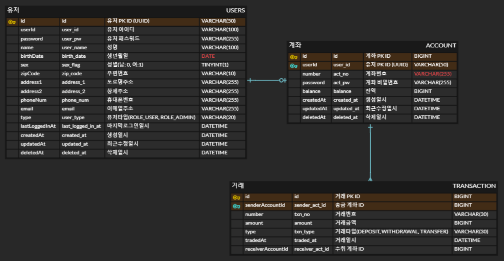

# 🏦 MyFin 핀테크 서비스 만들기
계좌를 통해 입금, 출금, 송금 등의 서비스를 제공하는 나만의 간단한 핀테크 서비스입니다. 

## 🏢 프로젝트
### 프로젝트(서비스) 이름
MyFin (My-Fintech)
### 프로젝트 목적
제로베이스 개인과제에서 주어진 핀테크 도메인을 주제로 하여 `Java Spring Framework` 기반의  
`Restful API 서버`를 구현하기 위함이며, `일반 유저의 View`는 모바일 애플리케이션이다.

### 프로젝트 기간
2023.07.11 ~ 2023.08.xx

### 프로젝트 인원
1명 (개인 프로젝트)

## 💵 서비스 기능 및 설계
- 유저 기능
  - 회원가입
    - 사용자는 회원가입을 할 수 있다. 기본적으로 모든 사용자는 회원가입 시 USER 권한(일반 권한)을 갖는다.
    - 회원가입 시 `아이디와 패스워드, 성명, 생년월일, 성별, 자택 주소(도로명주소 + 상세주소), 휴대폰 번호, 이메일 주소`를 입력받으며, 아이디와 휴대폰번호는 **unique**해야 한다.
    - 추가적으로 휴대폰 본인인증도 요구된다.  
  - 로그인
    - 사용자는 로그인을 할 수 있다. 로그인 시 회원가입 때 입력한 `아이디와 패스워드`가 일치해야 한다.
    - 로그인은 JWT 토큰을 활용하며, 로그인의 응답으로 `AccessToken과 RefreshToken`을 반환한다.

- 계좌 기능
  - 생성
    - 로그인한 유저는 권한에 관계없이 계좌를 생성할 수 있다.
    - 계좌 생성 시 `계좌 비밀번호, 초기 예치금`을 입력받는다.
    - `계좌 비밀번호`는 숫자 4자리여야 하며, 각 유저는 하나의 계좌만 생성가능하다.
    - 계좌 생성의 응답으로는 `유저정보(성명, 생년월일), 계좌정보(계좌번호, 잔액, 생성일시)`가 반환된다.
  - 삭제
    - 로그인한 유저는 권한에 관계없이 계좌를 삭제할 수 있다.
    - 계좌 삭제 시 `계좌번호, 계좌 비밀번호`을 입력받는다.
    - 삭제할 계좌의 `계좌번호, 계좌 비밀번호`가 일치해야 한다.
    - 삭제할 계좌의 잔액이 `0원`보다 초과할 경우에는 계좌를 삭제할 수 없다.
  - 입금
    - 로그인한 유저는 권한에 관계없이 특정 계좌에 입금할 수 있다.
    - 계좌 입금 시 `계좌번호, 입금액`을 입력받는다.
    - 입금액이 `0원 이하`인 경우는 불가능하다.
    - 계좌 입금의 응답으로는 `계좌정보(계좌번호, 잔액, 생성일시, 수정일시), 거래정보(입출금번호, 입금액, 입금일시)`가 반환된다.
  - 출금 (인출)
    - 로그인한 유저는 권한에 관계없이 특정 계좌의 잔액 중 전체 또는 일부를 출금할 수 있다.
    - 계좌 출금 시 `계좌번호, 계좌 비밀번호, 출금액`을 입력받는다.
    - 출금할 계좌의 `계좌번호, 계좌 비밀번호`가 일치해야 한다.
    - `출금액`이 계좌 잔액보다 큰 경우는 불가능하다.
    - 계좌 출금의 응답으로는 `계좌정보(계좌번호, 잔액, 생성일시, 수정일시), 거래정보(입출금번호, 출금액, 출금일시)`가 반환된다.
  - 내 계좌 정보 조회
    - 로그인한 유저는 권한에 관계없이 자신의 계좌 정보를 조회할 수 있다.
    - 계좌 조회 시 `계좌번호, 계좌비밀번호`를 입력받는다.
    - 로그인 유저의 계좌 정보와 요청 계좌정보가 일치하지 않으면 조회할 수 없다.
    - 내 계좌 정보 조회의 응답으로는 `계좌 정보(계좌번호, 잔액, 생성일시, 수정일시)`가 반환된다.
  - 검색
    - 모든 사용자는 `계좌번호 또는 휴대폰번호`를 통해 계좌를 검색할 수 있다.
    - 계좌 검색은 단건만 가능하다.
    - 계좌 검색의 응답으로는 `메타정보(검색결과 여부), 유저정보(성명)`가 반환된다.

- 거래 기능
  - 송금
    - 로그인한 유저는 권한에 관계없이 타 계좌에 송금할 수 있다.
    - 송금 시 `계좌번호, 계좌 비밀번호, 송금 계좌은행, 송금 계좌번호, 송금액, 송금자이름(기본값:로그인유저 성명)`을 입력받는다.
    - `송금액`이 해당 계좌의 잔액보다 큰 경우는 불가능하다.
    - 송금의 응답으로는 `계좌정보(계좌번호, 잔액), 거래정보(거래번호, 거래금액, 송금은행, 송금계좌번호, 거래일시)`가 반환된다.
  - 이력 조회
    - 로그인한 유저는 권한에 관계없이 계좌의 송금이력을 조회할 수 있다.
    - 송금이력은 기본적으로 유저의 모든 계좌의 송금이력이 최신순으로 정렬되며, 최신순의 역정렬 및 거래액이 많은순/적은순 으로도 정렬 가능하다.
    - 특정 계좌에 대한 송금이력 조회할 수 있으며, 이 또한 최신순으로 정렬되며 최신순의 역정렬 및 거래액이 많은순/적은순 으로도 정렬 가능하다.
    - 송금이력 조회의 응답으로는 `List<유저정보(성명), 계좌정보(계좌번호), 거래정보(거래번호, 거래금액, 송금은행, 송금계좌번호, 거래일시)>`가 반환되며, 해당 응답은 모바일 환경에 맞게 `Slice`객체로 반환됨에 따라 pagination 을 지원한다.

## 📃 API 명세서
[go to the API Specification](docs/API_Specification.md)

## 🪟 ERD

## 🪠 Trouble Shooting
[go to the trouble shooting section](docs/Trouble_Shooting.md)

***

  <h2>Tech Stack</h2>
  

     
     
     
    
  

  

     
     
    
    
  

  

    
    
    
  

